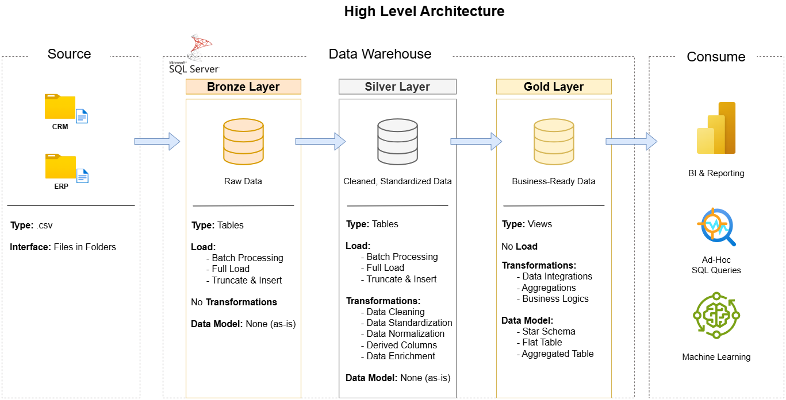
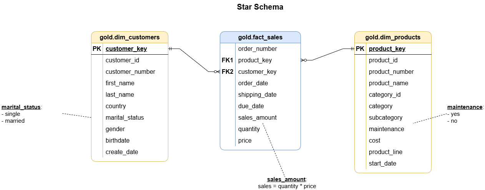

# Retail Sales Data Warehouse with SQL Server
## Overview

This project is an end-to-end data warehouse built with SQL Server. It transforms raw CRM and ERP CSV files into a clean, structured, and analytics-ready model.

The goal is not only to load data, but also to improve data quality before it is used for reporting. Poorly cleaned data can still produce reports, but those reports may be inaccurate or misleading.

## Architecture



```text
Source CSV Files
      |
      v
Bronze Layer  -> Raw data ingestion
      |
      v
Silver Layer  -> Data cleaning and standardization
      |
      v
Gold Layer    -> Business-ready analytical model
```

### Why Bronze / Silver / Gold?

I used this architecture to separate the pipeline into clear responsibilities:

| Layer | Purpose |
|---|---|
| Bronze | Stores raw source data with minimal transformation |
| Silver | Cleans, standardizes, and prepares data |
| Gold | Provides business-ready views for analysis |

This makes the pipeline easier to debug, validate, and explain.

## Layer Responsibilities

### Bronze Layer

The Bronze layer loads raw CRM and ERP CSV files into SQL Server while keeping the original source structure.

Example tables:

- `bronze.crm_cust_info`
- `bronze.crm_prd_info`
- `bronze.crm_sales_details`
- `bronze.erp_cust_az12`
- `bronze.erp_loc_a101`
- `bronze.erp_px_cat_g1v2`

### Silver Layer

The Silver layer handles the main data cleaning work.

It solves issues such as:

- Duplicate customer records
- Extra spaces in text fields
- Inconsistent gender and marital status values
- Invalid or missing dates
- Missing product costs
- Incorrect or missing sales amounts
- Inconsistent country values

This is the most important layer because the quality of the Gold layer depends on how well the data is cleaned here.

### Gold Layer

The Gold layer provides analytical views using a star schema.



| View | Type | Description |
|---|---|---|
| `gold.dim_customers` | Dimension | Customer profile with demographic and location data |
| `gold.dim_products` | Dimension | Product details with category information |
| `gold.fact_sales` | Fact | Sales transactions linked to customers and products |

## Data Quality Issues Handled

This project handles several practical data quality issues:

- Keeps the latest customer record when duplicates exist
- Standardizes values such as `M`, `F`, `S`, and `M` into readable labels
- Converts raw date values into SQL `DATE` format
- Splits product keys into category ID and product number
- Recalculates sales and price values when source values are inconsistent
- Standardizes ERP country and gender values
- Validates Gold layer relationships between fact and dimension views

## Repository Structure

```text
sql-data-warehouse/
│
├── data/
│   ├── source_crm/
│   └── source_erp/
│
├── docs/
│   ├── architecture.png
│   ├── data_flow.png
│   ├── data_integration.png
│   ├── star_schema.png
│   └── data_catalog.md
│
├── scripts/
│   ├── init_database.sql
│   ├── bronze/
│   │   ├── ddl_bronze.sql
│   │   └── proc_load_bronze.sql
│   ├── silver/
│   │   ├── ddl_silver.sql
│   │   └── proc_load_silver.sql
│   └── gold/
│       └── ddl_gold.sql
│
├── tests/
│   └── quality_checks_gold.sql
│
├── LICENSE
└── README.md
```

## How to Run the Project

### Prerequisites

- SQL Server
- SQL Server Management Studio
- Permission to run `BULK INSERT`

### Steps

1. Run database initialization script:

```sql
scripts/init_database.sql
```

2. Create Bronze tables:

```sql
scripts/bronze/ddl_bronze.sql
```

3. Load data into Bronze:

```sql
EXEC bronze.load_bronze
    @data_root = N'C:\Users\YourName\Documents\sql-data-warehouse\data';
```

4. Create Silver tables:

```sql
scripts/silver/ddl_silver.sql
```

5. Load data into Silver:

```sql
EXEC silver.load_silver;
```

6. Create Gold views:

```sql
scripts/gold/ddl_gold.sql
```

7. Run quality checks:

```sql
tests/quality_checks_gold.sql
```

Expected data folder structure:

```text
data/
├── source_crm/
│   ├── cust_info.csv
│   ├── prd_info.csv
│   └── sales_details.csv
│
└── source_erp/
    ├── CUST_AZ12.csv
    ├── LOC_A101.csv
    └── PX_CAT_G1V2.csv
```

## What I Learned

The biggest lesson from this project is that a data pipeline is only useful when the data it produces is reliable.

I learned that ETL is not just about moving data from source files into tables. The most valuable part is often the cleaning and transformation layer, where raw data becomes consistent and trustworthy.

If duplicate records, invalid dates, inconsistent labels, or incorrect sales amounts are not handled properly, the final reports may still run but can lead to misleading insights.

Through this project, I practiced:

- Designing a layered data warehouse
- Cleaning and standardizing raw data with SQL
- Handling common data quality issues
- Building dimension and fact views
- Validating the final Gold layer with quality checks
- Documenting a data project clearly

## Acknowledgement

This project was built as part of my data engineering learning journey.

The overall structure was inspired by public SQL data warehouse learning materials and tutorials, especially the Bronze, Silver, and Gold architecture. I used those materials as a reference, then reviewed, modified, documented, and explained the project in my own way.

The purpose of this repository is to demonstrate my understanding of SQL-based data warehousing, data cleaning, transformation logic, and data quality validation.

## License

This project is licensed under the MIT License.
